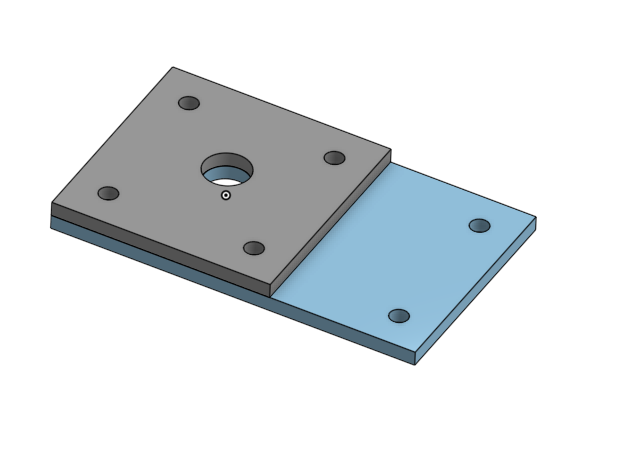

# BasicCAD

We are creating a caster.

---
## Table of Contents
* [Table of Contents](#Table-of-Contents)
* [Base](#Base)
* [Mount](#Mount)
* [Fork](#Fork)
* [Tire](#Tire)
* [Wheel](#Wheel)
* [AxleCollarBearings](#AxleCollarBearings)

## Base

### Description

The first assignment is to create the caster base.  The base's dimensions are 200 mm x 120 mm and 8 mm thick.  It has 6 holes 10 mm wide and 20 mm from the edge equally spaced along the edges.

### Evidence
[The Base in Onshape](https://cvilleschools.onshape.com/documents/0d70f655203ca304cb3c5b7d/w/f55603f962f6fc74f5548a68/e/41d730c570a8d75fce9f51b6)

### Image
This is how you will write image code for INTERNALLY STORED images on your repo.   just FYI.
~~~

~~~

### Reflection

This was my first Onshape part and [following along with Dr. Shields made it super easy.](https://www.youtube.com/watch?v=93BFUD-HAG8&feature=emb_title&scrlybrkr=5670f0b4)  I learned about 
* sketching (shortcut **shift-s**)
* constructions lines (shortcut **Q**)
* dimensions (shortcut **D**)
* extruding both add and remove (shortcut key **E**)
* linear patterns (no shortcut)

Onshape is awesome.  I found it really helpful to rename all my sketches.  It is going to be a GREAT year in engineering.

---

## Mount

### Description

This is the mount that goes on the base. 

### Evidence
[Mount](https://cvilleschools.onshape.com/documents/eae458120bc23168a98d6fb4/w/a5c12eff43e1aa6cb2466f30/e/886f47434d7e3a781985a8de)
### Image

### Reflection
I learned how to mirror cuts in onshape
---

## Fork

### Description
This is the "fork" of the caster
### Evidence
[Fork](https://cvilleschools.onshape.com/documents/a0fe91082d7fc43f5e50d3b8/w/a0d46cf4802c52b5b1fafefd/e/e9897347fb3631be38c86315)
### Image

### Reflection
I learned how to do fillets to make surfaces rounded, I can choose how much I want sides to be cut
---

## Tire

### Description
This is what the wheel will go into 
### Evidence
[Wheel](https://cvilleschools.onshape.com/documents/cfa514728a95d9c4e30b90a6/w/482b877e159a13e4f56353df/e/78054b8e86e6f0f15cab3d4a)
### Image

### Reflection
I made a simple shape and used the revolve feature to turn it into a tire, I also used fillets again to round it out
---

## Wheel

### Description
This is what goes in the tire, it will help the caster to turn
### Evidence
[Wheel](https://cvilleschools.onshape.com/documents/cfa514728a95d9c4e30b90a6/w/482b877e159a13e4f56353df/e/192ec988b7cb1599a584a818)

### Image

### Reflection
I used circular patterns for the first time which basically mirror images around a circular area
I also used fillets to round it out
---

## AxleCollarBearings

### Description
This is the axle of the wheel, it makes it turn
### Evidence
[AxleCollar](https://cvilleschools.onshape.com/documents/cfa514728a95d9c4e30b90a6/w/482b877e159a13e4f56353df/e/6e985874b44f2a7d3522c73e)
### Image

### Reflection
I used the mirror feature to relfect a cut I made and used a coincident relation to stick 2 parts together
---

### Sub Assembly

### Description
This is the partial assembly of the caster
### Evidence
[SubAssembly](https://cvilleschools.onshape.com/documents/cfa514728a95d9c4e30b90a6/w/482b877e159a13e4f56353df/e/3bc9645c59951f01b94f0480)
### Image

### Reflection
I used fasten and revolute mates for the first time
---
